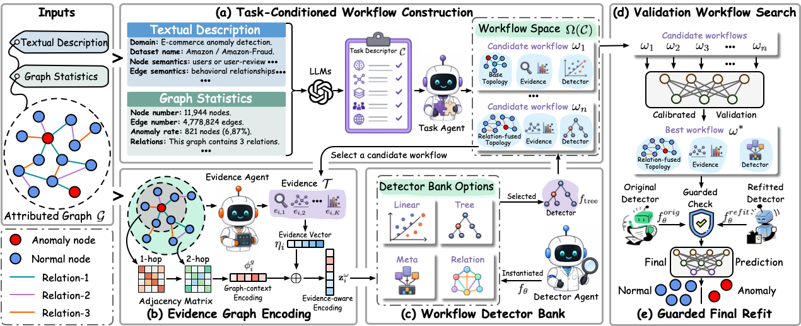

# Detect by Yourself: Self-Designing Agentic Workflows for Few-Shot Graph Anomaly Detection


<p align="center">
	<!-- <a href="https://iclr.cc/virtual/2026/poster/10006814">
    
  </a> -->
  <!-- <a href="https://arxiv.org/abs/2510.04284">
    
  </a> -->
  <a href="https://github.com/Tairan-Terrian/SignGAD">
    
  </a>
  <a href="https://github.com/Tairan-Terrian/SignGAD/blob/master/LICENSE">
    
  </a>
</p>

Detect by Yourself: Self-Designing Agentic Workflows for Few-Shot Graph
Anomaly Detection is a lightweight, graph anomaly detection repository for node-level anomaly detection.



## 🛠️ Installation

Recommended: Python 3.10 or 3.11.

```bash
conda create -n signgad python=3.10 -y
conda activate signgad
pip install -r requirements.txt
```

`requirements.txt` contains the runtime dependencies used by the current graph pipeline. The detectors are implemented with NumPy, SciPy, and scikit-learn.


Notes: To facilitate reproducibility for researchers with limited GPU resources, we use API-key-based LLM calls in our implementation, which avoids the need for substantial local GPU resources. Users with sufficient computational resources may also deploy the LLM locally.

Optional: enable LLM-assisted planning by setting with your API key in `src/config/config.py`.

```bash
    OPENAI_API_KEY = os.environ.get("OPENAI_API_KEY") or "YOUR_API_KEY"
    OPENAI_API_BASE = os.environ.get("OPENAI_API_BASE") or "YOUR_API_BASE_URL"
```


## 🔬 Datasets

Datasets are expected under `data/`.

`main.py` calls the built-in downloader for the DGL Amazon and YelpChi `.mat` files before each run. T-Finance and T-Social are local DGL graph files and are not downloaded automatically.

### Amazon

- Config: `configs/amazon.yaml`
- Path: `data/Amazon.mat`
- Task: fraudulent or suspicious review-centric user detection
- Features: 25-dimensional handcrafted behavior features
- Relations: `net_upu`, `net_usu`, `net_uvu`
- Source: DGL `FraudAmazonDataset`
- URL: https://data.dgl.ai/dataset/FraudAmazon.zip or https://docs.dgl.ai/en/0.8.x/api/python/dgl.data.html

### YelpChi

- Config: `configs/yelpchi.yaml`
- Path: `data/YelpChi.mat`
- Task: spam/fraud review detection
- Features: 32-dimensional handcrafted behavior features
- Relations: `net_rur`, `net_rsr`, `net_rtr`
- Source: DGL `FraudYelpDataset`
- URL: https://data.dgl.ai/dataset/FraudYelp.zip or https://docs.dgl.ai/en/0.8.x/api/python/dgl.data.html

If `data/Amazon.mat` or `data/YelpChi.mat` is missing, the code downloads and extracts it automatically with a progress bar.

### T-Finance / T-Social

- Configs: `configs/tfinance.yaml`, `configs/tsocial.yaml`
- Paths: `data/tfinance`, `data/tsocial`
- These are not auto-downloaded. Put the DGL graph files under `data/` before running them.
- URL: https://github.com/squareRoot3/Rethinking-Anomaly-Detection

## ✨ Quick Start

Run Amazon:

```bash
python main.py --config amazon
```

Run YelpChi:

```bash
python main.py --config yelpchi
```

Run T-Finance or T-Social after placing the DGL graph files under `data/`:

```bash
python main.py --config tfinance
python main.py --config tsocial
```

Full run logs are saved under `runs/`, for example:

```text
runs/amazon_20260507_162541.json
```

## 📰 Custom Usage
Researchers can design their own datasets for model training

A minimal config looks like this:

```yaml
dataset: data/Amazon.mat
description: |
  domain: review fraud detection
  anomaly objective: detect fraudulent users
train_ratio: 0.01
val_ratio: 0.495
test_ratio: 0.495
seed: 42
```

Then create a config and run:

```bash
python main.py --config configs/your_config.yaml
```

### Custom DGL Graph Dataset

For non-`.mat` graph files, the loader expects a homogeneous DGL graph saved with `dgl.data.utils.save_graphs`. Node data must include:

```text
feature or features
label
```

Optional `train_mask`, `val_mask`, and `test_mask` node fields are used when present. Otherwise the split ratios from the config are used.


